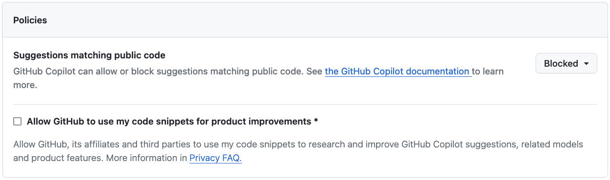
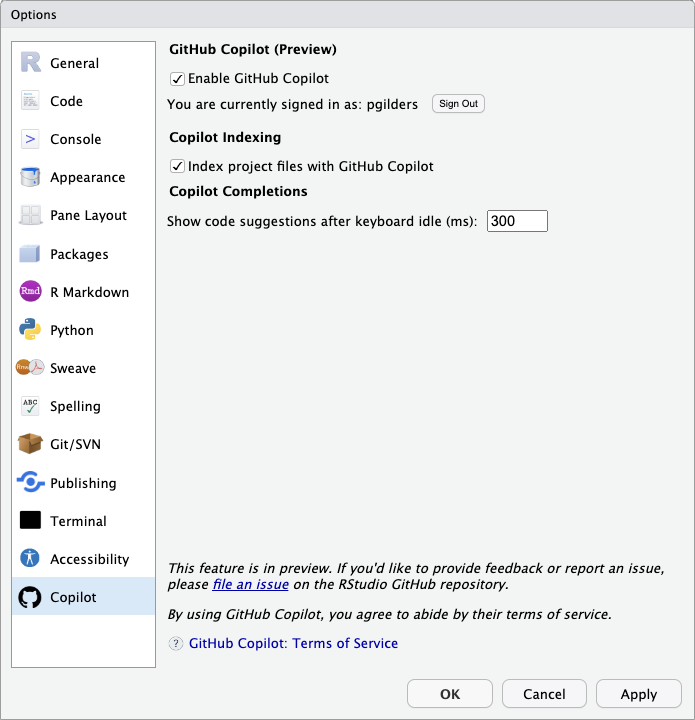
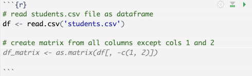

# Copilot in RStudio

This is a brief guide for setting up and using GitHub Copilot in RStudio. Copilot is an AI tool that helps you write code. It is not perfect, but is often of great help to productivity and in problem solving. Be aware that it is not a replacement for learning to code. It is a tool to help you code better and faster. In addition, as with any AI tool, it is important to be aware of the limitations, appropriate use cases, and potential biases of the tool. I will cover these topics in another guide. For now, I will focus on setup.

## GitHub Student Developer Pack

If you are a student, you can get access to a lot of free software and services through the [GitHub Student Developer Pack](https://education.github.com/pack). This includes access to Copilot, as well as a lot of other useful tools. You will need to sign up for a GitHub account and verify your student status to get access to the pack.

## Activating Copilot in GitHub

In your GitHub account, navigate to [Settings > Account > Copilot](https://github.com/settings/copilot) and click the button to activate Copilot.

There are some settings to consider:

Firstly, "Suggestions matching public code". If allowed, Copilot will use public code to help you write your code. This is useful, but you should be aware that it may use code that is not licensed for use in your project. If you are writing code for a commercial project, you should probably turn this off. In addition, this is more likely to veer into plagiarism territory. It is possible to credit the sources of these code suggestions. For most student cases I would recommend setting this to "Blocked".

Secondly, there is the setting "Allow GitHub to use my code snippets for product improvements". If you are using any sensitive data or proprietary code, you should definitely uncheck this box. If you leave this box checked, any code (and text, previews of data, etc.) that you type in RStudio may be sent to GitHub to train their Copilot AI. Most project ethics boards would not allow this. Personally, I also would prefer not sharing my code with GitHub. I recommend unchecking this box.

## Installing Copilot in RStudio

You will need a farily new version of RStudio (≥ 2023.09.0). You can check your version by going to the "Help" menu and selecting "About RStudio". If you need to update, you will need to download the [latest version](https://posit.co/products/open-source/rstudio/).

Within RStudio, Navigate to Tools > Global Options > Copilot, check the box to activate and sign in to GitHub. You will need to authorize RStudio to access your GitHub account.

## Using Copilot in RStudio

Follow [this page](https://docs.posit.co/ide/user/ide/guide/tools/copilot.html) for further guidance for setup and use of Copilot in RStudio.

In standard use, Copilot will suggest code (indicated by greyed out text) as you type. You can accept the suggestion by pressing the tab key. Copilot uses the context of your code and any comments you write to make suggestions. Use informative variable names and comments to help Copilot make better suggestions.

Here are some further guides for using Copilot:

- [How to use GitHub Copilot: Prompts, tips, and use cases](https://github.blog/2023-06-20-how-to-write-better-prompts-for-github-copilot/)
- [Introduction to GitHub Copilot](https://learn.microsoft.com/en-us/shows/introduction-to-github-copilot/)

Happy coding!